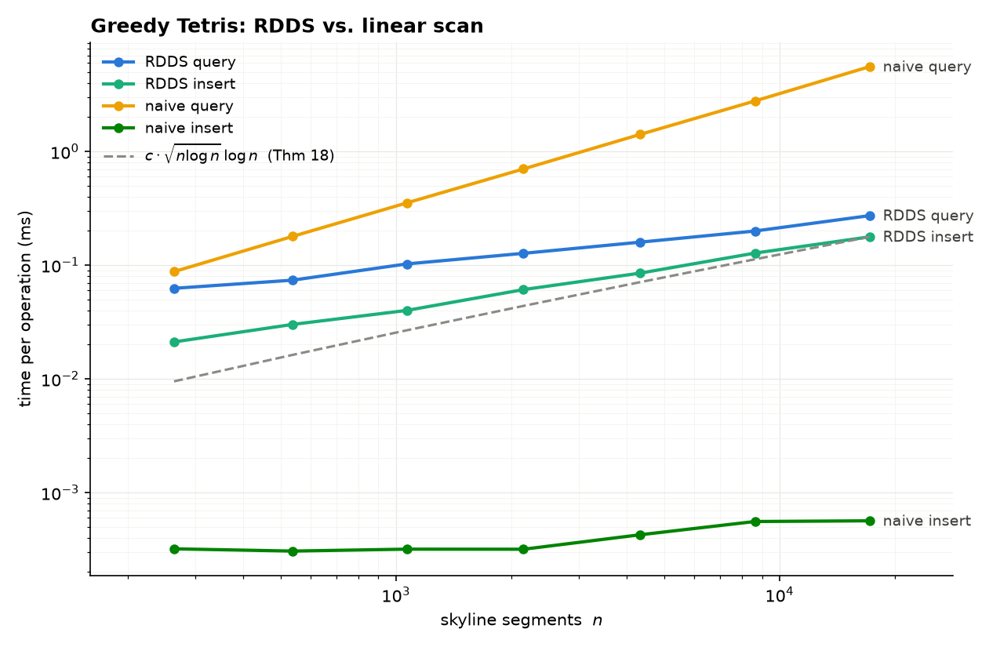

# Rectangle Dropping Data Structure

A tested, benchmarked Python implementation of the **Rectangle Dropping Data
Structure (RDDS)** from Section 4 of

> Justin Dallant and John Iacono,
> *"How fast can we play Tetris greedily with rectangular pieces?"*
> ([arXiv:2202.10771](https://arxiv.org/abs/2202.10771))

originally developed for my Bachelor thesis in
[Computer Science @ UniRoma2](http://informatica.uniroma2.it).

The data structure plays **greedy Tetris with rectangular pieces**: given a
piece of some width, it finds the lowest position where the piece can rest and
drops it there — in **O(n<sup>1/2</sup> log<sup>3/2</sup> n)** time per piece
(Theorem 18 of the paper), instead of the obvious Θ(n) scan of the whole
skyline.



*Measured on random games (see [Benchmarks](#benchmarks)): the RDDS insert
curve fits a log-log slope of ≈ 0.52 — the paper's √n̄ bound — while the naive
query scan is exactly linear.*

## How it works

The structure maintains the **skyline** of all dropped rectangles (the upper
envelope, Definition 14), broken into **O((n / log n)<sup>1/2</sup>) chunks**
of at most 2 (n log n)<sup>1/2</sup> segments each. Every chunk precomputes:

- a **gap table** (Lemma 16): for each height, the widest interval where the
  skyline stays at or below that height, prefix-maxed so a floor lookup
  answers in O(log n);
- its **staircases** (the prefix/suffix maxima of the chunk), used to measure
  gaps that *span* several chunks via the sliding two-pointer corridor scan of
  Theorem 17.

A query for a piece of width *w* binary-searches the O(n) candidate landing
heights (Theorem 18); an insert splices the piece into the affected chunks and
restores the size bounds by splitting/merging locally.

See **[docs/paper-mapping.md](docs/paper-mapping.md)** for a precise map from
each lemma/theorem of the paper to the code that implements it.

## Install

```bash
git clone https://github.com/davidetoniatti/rectangle-dropping-data-structure.git
cd rectangle-dropping-data-structure
pip install -e ".[viz]"      # viz extra = matplotlib, needed only for demos
```

Requires Python ≥ 3.10. The core depends only on `sortedcontainers`.

## Usage

```python
from rdds import RDDS, Rect

board = RDDS(board_width=40)

# Greedy Tetris: where does a 5-wide piece land the lowest?
height, x = board.query(width=5)

# Drop a 5x3 piece there.
board.insert(width=5, height=3, x=x)

# Widest rectangle droppable at or below height 10 (Lemma 16 / Theorem 17).
gap = board.widest_gap(10)          # Gap(width, x0, x1)

board.skyline()                     # list[Segment]: the current upper envelope
```

The constructor also accepts a prefilled scene: `RDDS(40, [Rect(x=0, y=0,
width=9, height=5), ...])`, built in O(n log n) by plane sweep (Lemma 15).

## Demo

An animated greedy game — every probe of the query algorithm is drawn
(chunk-gap lookups in blue, cross-chunk corridors in orange, the falling
piece), driven purely by the core's event stream:

```bash
python -m rdds.demo.tetris --width 60 --pieces 30 --speed 0.3
python -m rdds.demo.tetris --headless --out board.png   # no display needed
```

Click the figure to pause/resume. The animation layer
(`rdds.viz.SkylineAnimator`) is a plain observer: the core emits events
(`GapProbe`, `PieceDropped`, …) and knows nothing about rendering, so the
algorithmic code stays pure and testable.

### Browser player

The same event stream can be recorded to JSON and replayed in the browser —
no Python needed to view, with play/pause/step, speed control and timeline
scrubbing:

```bash
python -m rdds.demo.tetris --web              # play, build player.html, open browser
python -m rdds.demo.tetris --record game.json # just the JSON recording
```

`--web` writes a single self-contained HTML file (recording embedded, no
dependencies, no network) that works from disk or any static host — drag any
other recording onto it to replay that instead. A hosted example lives at
[docs/player.html](docs/player.html). Keyboard: space = play/pause,
←/→ = step.

## Correctness

The implementation is validated by **property-based testing** against a
brute-force oracle (`rdds.NaiveBoard`, a grid of unit columns where every
operation is an obvious scan). Thousands of randomized games are played on
both implementations, asserting after every move that skylines, landing
heights, query answers and widest-gap results agree exactly, plus structural
invariants (chunk size bounds, board coverage, candidate-height superset).

```bash
pip install -e ".[dev]"
pytest                                    # 200 random games per property
HYPOTHESIS_PROFILE=heavy pytest           # 2000 games per property
ruff check src tests && mypy              # lint + strict typing
```

## Benchmarks

```bash
python benchmarks/bench.py --out docs/benchmark.png --csv docs/benchmark.csv
```

Plays greedy games at growing sizes and measures per-operation time for the
RDDS against the obvious linear scan, fitting log-log slopes and plotting the
theoretical O(√(n log n) · log n) guide. Representative run (Python 3.14, M-series):

| skyline segments | RDDS query | RDDS insert | naive query (O(n)) |
|---:|---:|---:|---:|
| 1 067 | 0.10 ms | 0.04 ms | 0.35 ms |
| 4 338 | 0.16 ms | 0.09 ms | 1.41 ms |
| 17 193 | 0.27 ms | 0.18 ms | 5.58 ms |

The naive *insert* on a grid is a C-speed slice assignment and stays near
zero — the linear cost of the naive approach lives in its query scan, which is
exactly what the RDDS removes.

## Project layout

```
src/rdds/core/       pure data structure (no rendering dependencies)
  geometry.py        Segment, Rect, Gap
  skyline.py         plane-sweep construction          (Lemma 15)
  chunk.py           gap table + staircase records     (Lemma 16)
  structure.py       chunked RDDS: query/insert        (Theorems 17, 18)
  naive.py           brute-force oracle used by the tests
  events.py          observer events for renderers
  recording.py       JSON game recordings for the web player
src/rdds/viz/        matplotlib animation layer (optional extra)
src/rdds/demo/       python -m rdds.demo.tetris
tests/               property-based tests vs. the oracle
benchmarks/          empirical verification of the bounds
docs/player.html     self-contained browser replayer (+ example game.json)
docs/paper-mapping.md  lemma-by-lemma map from paper to code
```
